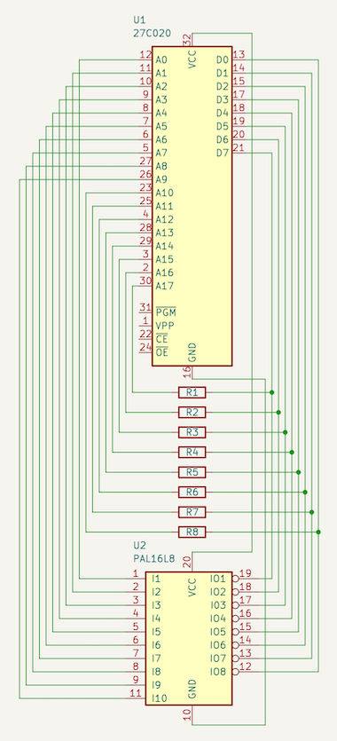
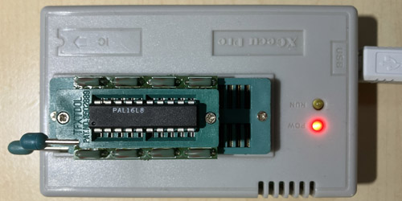
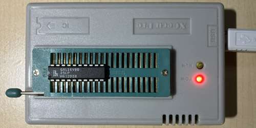

# Rationale

This work started within the thread
"Project to create an ATX 80286 mainboard based on the IBM 5170"
at the Vintage Computer Federation Forums
(https://forum.vcfed.org/index.php?threads/project-to-create-an-atx-80286-mainboard-based-on-the-ibm-5170.1243108/).

The thread creator (username "rodney") looked for help on how to retrieve the PAL equations
of U87 and U130 on the IBM 5170 (the original IBM PC/AT computer) motherboard.
While I tried to help, he figured the equations out with other tooling from
http://techno-junk.org, but I found the topic interesting, so I kept on researching.

# History

Reverse engineering PAL chips has likely been done as early as in the 1980s, when plenty
of companies cloned the PC/AT. Probably this has just not been publicly documented.

The earliest description of the idea behind I could find was a schematic from 2007 with
title "PLD Analysis Board" developed by Charles M. (I'm trying to avoid publishing full names,
hence "M.") and apparently originally available at http://cgfm2.emuviews.com. This site
is no longer available, but a small subset of the information and schematics can be found at
http://techno-junk.org. A PCB design for these schematics is available at
https://github.com/pascalorama/paldumper.

Another description of the same idea has been published in the Vintage Computer Federation
Forums by user "Chuck(G)" (Blog entries "Cloning a PAL/HAL") in October 2011. He was describing
how to do the brute force readout on a PAL10L8 using a PC parallel port adapter and suggested
to use a microcontroller for more complicated PALs. The microcontroller idea was implemented
and described at https://electrickery.hosting.philpem.me.uk/digaud/arduino/ppread/palread.html.

In 2018, another implementation of the same idea was published at
https://github.com/psurply/ReGAL.

In 2020, https://github.com/DuPAL-PAL-DUmper was published, providing
support for more PALs (even registered ones).

Rodney used the "EPROM readout adapter" from http://techno-junk.org which basically
"misuses" a chip programmer to apply all possible input combinations to the PAL via the
EPROM address lines A0..A17. An analysis tool is then used to transform the "EPROM dump"
into boolean equations. However, the boolean simplification and the job to produce a
"fuse map" JEDEC file used to burn the equations into a PAL/GAL device is left to other tools.

# Credits

Thanks go to:
- User "rodney" from the vcfed forums for kicking this all off
- User "Chuck(G)" from the vcfed forums for his excellent write-up on PAL reversing
- Charles M. from http://techno-junk.org for his "EPROM adapter" idea
- User "Eudimorphodon" from the vcfed forums for helping me understand PAL/GAL details

# Restrictions

The adapter and the scripts in this project only support the PAL16L8 chip for reading and
the GAL16V8 chip for writing. From the latter, only the subset of features necessary to use
it for replacing a PAL16L8 is used.

# Idea

The main idea of this project is to provide a "one stop solution" to make a clone
of a PAL16L8 in the form of a GAL16V8. It consists of:
- A KiCad project (including PCB) implementing http://techno-junk.org/files/adapter-v2-cap.png
- A Python script "pete.py" to convert a PAL "EPROM dump" into a truth table and GAL equations
- A Python script "simplegalasm.py" to convert GAL equations into a JED file which can be written into a GAL16V8

For complex PALs, it might be necessary to manually tune the GAL equations generated by "pete.py",
see examples below.

# Usage

## Build the adapter

You need to build up a circuit board according to the following schematic:



It is up to you to either hand wire this on a perfboard or to build it up with the
provided KiCad PCB. If you choose the latter, I have published it for easy ordering
at https://aisler.net/p/IUTCWVJK,
but you also might order it at your preferred PCB manufacturer, of course.

The original schematic from Charles M. suggested 4k7 resistors. This value doesn‘t work
for me (it does not give a stable reading with my minipro chip programmer) and neither
does 2k2. Only after going down to 1k, it worked for me and so you also might need to experiment.

## Install Python

Go to www.python.org, download a recent Python version (anything >= 3.7 should do) and install it.

## Generate "EPROM dump"

Put your PAL16L8 into the adapter and the adapter into your chip programmer.

(Do **NOT** put your PAL16L8 into your chip programmer directly - this will not work.)

	

Instruct your chip programming application to read a 27C020 EPROM and save the data
to a file, e.g. named pal.bin. The generated file length must be 262144
bytes. If your file length is different, something is broken. Do not try to continue,
it will not work.

E.g., if you own one of the popular MiniPRO TL866xx series of chip programmers and
have the excellent command line application from https://gitlab.com/DavidGriffith/minipro
installed, use:
```
minipro -p am27c020@dip32 -x -r pal.bin
```

**ATTENTION**: I found that this dump does not always work reliably, possibly due to timing
issues. Please make sure to perform the dump multiple times and compare the files. If you
cannot get multiple identical dumps, something is wrong in your setup.

## Generate the equations

On your command line, run `python3 pete.py pal.bin` (adapting the filename
to what you have chosen). This will generate a file called
pal_pete_equations.pld (adapted to your filename), which contains
the PAL equations.

## Fix up the equations

A GAL16V8 (like a PAL16L8) only supports up to 7 products per output value and
only up to 1 product per output enable. For complex PALs where one output value
depends on another output value, pete.py might not be able to find equations
within these limits. In this case, you need to think how to optimize further and
fix up the equations manually.

## Generate the JED file

On your command line, run `python3 simplegalasm.py pal_pete_equations.pld`
(again, adapting the filename to what you have chosen). This will generate a file called
pal.jed.

## Program your GAL

Put your GAL16V8B DIRECTLY into your chip programmer (NOT using the adapter!) and
instruct your EPROM programmer to write pal.jed to the GAL.

	

Again with the minipro command line utility as example:
```
minipro -p gal16v8b -w pal.jed
```

**ATTENTION**: Be careful to specify the exact GAL type you are using. "gal16v8" and
"gal16v8b" are **NOT** compatible at the chip programming level. The fuse maps (i.e.
the fuse numbers) are the same, but the order in which the fuse information is sent
during chip programming differ (this applies to fuse numbers 2120 to 2193). If
you specify the wrong type, programming seems to work fine, but the GAL outputs
will not behave according to the equations (just think about what happens when
you shuffle fuse numbers 2120 to 2193...).

# Examples

## Example 1

The first example analyzes the equations of U87 on the IBM 5170 (the original
IBM PC/AT computer) motherboard.

First, dump the PAL with the adapter PCB as described above:
```
minipro -p am27c020@dip32 -x -r ibm_5170_u87.bin
```

Then, let pete.py find out the equations:
As the U87 pin names are known from the IBM Personal Computer AT technical reference,
we pass them to pete.py:
```
python3 pete.py -p "RAS,MEMW,IOR,AIOW,Q1,IO_CS_16,AEN_1,AEN_2,Q4,FSYS_16,END_CYC,RES_0WS,DMA_AEN,XA0,XBHE,GATE_245,DIR_245,DATA_CONV" ibm_5170_u87.bin
```

The generated equations in ibm_5170_u87_pete_equations.pld will have one equation
which cannot be translated directly into a GAL fuse map. Let's leave
ibm_5170_u87_pete_equations.pld untouched and create a copy to modify:
```
cp ibm_5170_u87_pete_equations.pld ibm_5170_u87.pld
```

The problematic equation is:
```
XBHE.oe = !AEN_1
  # !AEN_2;
```

GAL16V8s only support one term per output enable. So we need to find a simplification.
Looking around in the remaining file, we will find:
```
!DMA_AEN = !AEN_1
  # !AEN_2;
```

That means, that the pin value equation (which **DOES** support more than one term!) for
`!DMA_AEN` is the same as for `XBHE.oe`. We can therefore replace the equation for `XBHE.oe`
like this:
```
XBHE.oe = !DMA_AEN;
```

Doing this change in ibm_5170_u87.pld gives as equations usable for creating the fuse map:
```
python3 simplegalasm.py ibm_5170_u87.pld
```

Congratulations, you can now program a GAL16V8B for replacing U87 in your IBM 5170 motherboard:
```
minipro -p gal16v8b -w ibm_5170_u87.jed
```

## Example 2

The second example analyzes the other PAL on the IBM 5170 motherboard: U130.

Get the EPROM dump using the adapter PCB:
```
minipro -p am27c020@dip32 -x -r ibm_5170_u130.bin
```

Let pete.py find out the equations:
```
python3 pete.py -p "RESET,ERROR,BUSY,XA0,XA3,XIOW,SM_IO,CS287,INTA,TIEDGND_11,NPCS,UNUSED_13,UNUSED_14,UNUSED_15,UNUSED_16,RESET_287,IRQ_13,BUSY_286" ibm_5170_u130.bin
```

This time, the equation for one output value will not be directly usable, so create a copy to modify again:
```
cp ibm_5170_u130_pete_equations.pld ibm_5170_u130.pld
```

The problematic equation is:
```
!UNUSED_14 = BUSY
  # ERROR
  # TIEDGND_11
  # CS287 & !RESET
  # SM_IO & !RESET
  # XA3 & !RESET
  # XIOW & !RESET
  # !INTA & !RESET;
```

GAL16V8s only support at most 7 terms per output value. So we need to find a simplification.
Looking around in the remaining file, we will find:
```
!IRQ_13 = BUSY
  # ERROR;
```

So, `BUSY # ERROR` can be replaced by `!IRQ_13`:
```
!UNUSED_14 = !IRQ_13
  # TIEDGND_11
  # CS287 & !RESET
  # SM_IO & !RESET
  # XA3 & !RESET
  # XIOW & !RESET
  # !INTA & !RESET;
```

Doing this change in ibm_5170_u130.pld gives as equations usable for creating the fuse map:
```
python3 simplegalasm.py ibm_5170_u130.pld
```

Congratulations, you can now program a GAL16V8B for replacing U130 in your IBM 5170 motherboard:
```
minipro -p gal16v8b -w ibm_5170_u130.jed
```
